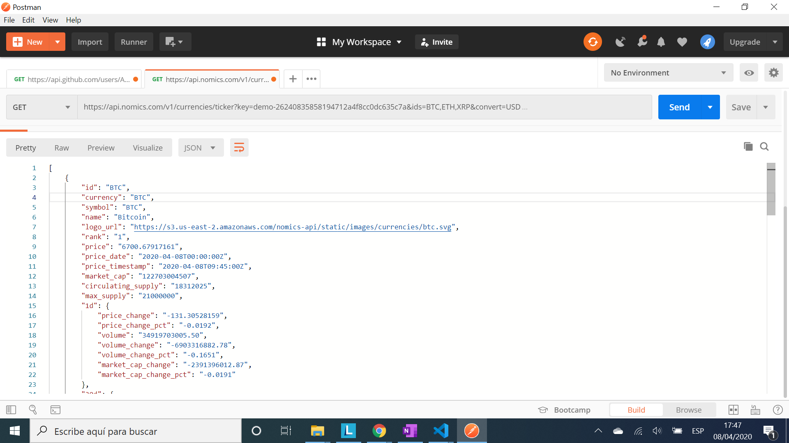
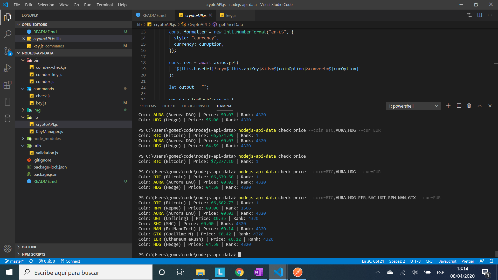

# :zap: Node.js API Data

* [Node.js](https://nodejs.org/en/) Command Line Interface (CLI) app that takes an API key user input and outputs [nomics cryptocurrency API](https://nomics.com/) data. Tutorial code (see 'Inspiration' below)

*** Note: to open web links in a new window use: _ctrl+click on link_**

## :page_facing_up: Table of contents

* [:zap: Node.js API Data](#zap-nodejs-api-data)
  * [:page_facing_up: Table of contents](#page_facing_up-table-of-contents)
  * [:books: General info](#books-general-info)
  * [:camera: Screenshots](#camera-screenshots)
  * [:signal_strength: Technologies](#signal_strength-technologies)
  * [:floppy_disk: Setup](#floppy_disk-setup)
  * [:computer: Code Examples](#computer-code-examples)
  * [:cool: Features](#cool-features)
  * [:clipboard: Status & To-Do List](#clipboard-status--to-do-list)
  * [:clap: Inspiration](#clap-inspiration)
  * [:envelope: Contact](#envelope-contact)

## :books: General info

* [Postman](https://www.postman.com) used to test API using a simple GET request
* [node.js bin](https://docs.npmjs.com/files/package.json) field used as executable file - maps command name to local file name. Important: file referenced in bin; `./bin/coindex.js` starts with `#!/usr/bin/env node`, otherwise the scripts are started without the node executable!

## :camera: Screenshots




## :signal_strength: Technologies

* [Node.js v12](https://nodejs.org/es/)
* [commander](https://www.npmjs.com/package/commander) node.js CLI solution
* [Inquirer](https://www.npmjs.com/package/inquirer) CLI user interface, used to prompt user for API key in `key.js` file
* [configstore](https://www.npmjs.com/package/configstore) used in KeyManager class to load and persist the API key user input
* [colors](https://www.npmjs.com/package/colors) to add colours to node.js (text colors: black, red, green, yellow, blue, magenta, cyan, white, grey. Other options available including bright colors etc.)
* [nomics cryptocurrency API](https://p.nomics.com/cryptocurrency-bitcoin-api) for JSON crypto coin data
* [axios](https://www.npmjs.com/package/axios) promise-based http client. `async/await` used instead of `.then()`
* [Postman API](https://www.postman.com/downloads/) to GET JSON data from API

## :floppy_disk: Setup

* Install dependencies using `npm i`
* Type `npm link` to make all commands work from any CLI directory
* Add default 32-character key from [nomics cryptocurrency API](https://nomics.com/)
* type `nodejs-api-data` to get top level commands list; `key` to manage API key, `check` to see crypto currency prices and `help`
* type `nodejs-api-data key` to get API key commands list; `set` to add key, `show` to see API key and `remove` to delete the key
* type `nodejs-api-data key -h` to get full list of key help commands
* type `nodejs-api-data key set`to get add key prompt. Enter the key obtained from [nomics cryptocurrency API](https://nomics.com/)
* type `nodejs-api-data key show`to display the API key
* type `nodejs-api-data key delete`to delete the API key
* type `nodejs-api-data check price`to see list of crypto currency prices.
  * type `nodejs-api-data check price --coin=BTC,INTU` to see price and rank of BTC and INTU cryptos (comma separated coin names (with NO spaces) used by API GET request - note: putting a coin name of ' ' (empty space) will return a list of ALL 2709 cryto coins!)

## :computer: Code Examples

* `key.js` function to set API key from user input. Note: I replaced the isRequired utility to use my own key from the .env file as default if no other key is set. I also added a check of the input string to ensure it is 12 characters long and only contains letters or numbers. Keys are now 32 characters long.

```javascript
async set() {
  const keyManager = new KeyManager();
  const input = await inquirer.prompt([
    {
      type: "input",
      name: "key",
      message: "Enter API key obtained from https://nomics.com or press ENTER to use default API key. ".green
    },
  ]);

  // If user enters an empty string my default API key from the .env file is used
  if (input.key === "") {
    const key = keyManager.setKey(process.env.API_key);
    console.log("default API key used".blue);
    return key;
  }

  // check if user inputs a key that is alphanumeric & 32 characters long
  else if (input.key.length === 32 && input.key.match(alphaNumeric)) {
    const key = keyManager.setKey(input.key);
    console.log("API key set".blue);
    return key;
  }

  // user to input key again if the input key was not an empty string or it was not 32 characters long
  console.log("API key should be alphanumeric and 32 characters long. ".red + "Try again.".blue);
  return;
},
```

## :cool: Features

* `coindex.js` is the first file executed. This calls the files in the `commands` folder. The `key.js` file calls the `lib` class `KeyManager` which includes key set, view and delete functions. It also calls the `utils` const `isRequired`. The `check.js` file calls the `lib` classes `KeyManager` and `CryptoAPI` and uses axios to make a http call to the nomics cryptocurrency API.
* `npm link` command used to make all commands work from any CLI directory

## :clipboard: Status & To-Do List

* Status: Working
* To-Do: Add functionality such as showing more data from the JSON API data returned. This is easy to do.

## :clap: Inspiration

* [Node.js CLI For Cryptocurrency Prices](https://www.youtube.com/watch?v=-6OAHsde15E)
* [nomics Crypto API documentation](http://docs.nomics.com/#operation/getCurrenciesTicker)

## :envelope: Contact

* Repo created by [ABateman](https://www.andrewbateman.org) - you are welcome to [send me a message](https://andrewbateman.org/contact)
